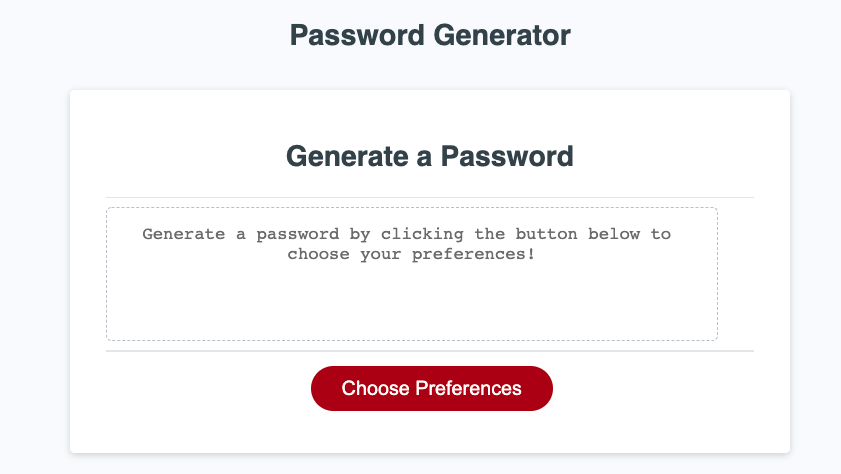

# Password-Generator

> If you are not willing to learn, no one can help you. If you are determined to learn, no one can stop you. -Zig Ziglar

## Description

Generate a new, random, and unique password that matches your specific criteria in order to provide you greater security.

---

## User Story
```

AS AN employee with access to sensitive data
I WANT to randomly generate a password that meets certain criteria
SO THAT I can create a strong password that provides greater security
```
---
## Acceptance Criteria
```

GIVEN I need a new, secure password
WHEN I click the button to generate a password
THEN I am presented with a series of prompts for password criteria
WHEN prompted for password criteria
THEN I select which criteria to include in the password
WHEN prompted for the length of the password
THEN I choose a length of at least 8 characters and no more than 128 characters
WHEN asked for character types to include in the password
THEN I confirm whether or not to include lowercase, uppercase, numeric, and/or special characters
WHEN I answer each prompt
THEN my input should be validated and at least one character type should be selected
WHEN all prompts are answered
THEN a password is generated that matches the selected criteria
WHEN the password is generated
THEN the password is either displayed in an alert or written to the page
```
---


## Important Links

- [Deployed URL](https://caitlyn-griffing.github.io/Password-Generator/)

- [GitHub URL](https://github.com/caitlyn-griffing/Password-Generator)


---

## Images of Deployed Web Page




---
